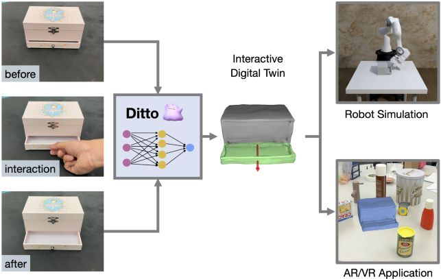
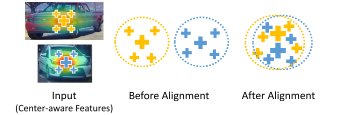
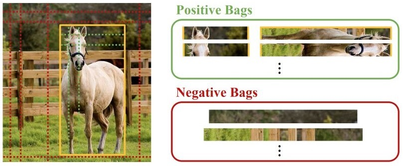
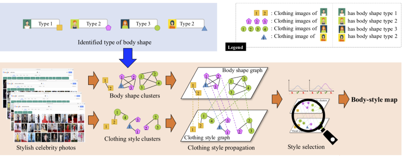
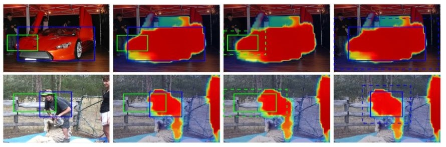

## About Me
I am a second-year MS student in Computer Science at UT Austin, advised by Prof. <a href="https://rpl.cs.utexas.edu/publications/">Yuke Zhu</a>.
 My research lies at the intersection of <i>robotics</i> and <i>computer vision</i>.

<!-- Previously, I was a research assistant at Academia Sinica, advised by Prof. <a href="https://sites.google.com/site/yylinweb/publications/">Yen-Yu Lin</a>. I was also working intensively with Prof. <a href="http://vllab.ucmerced.edu/publication/">Ming-Hsuan Yang</a> and Dr. <a href="https://sites.google.com/site/yihsuantsai/research/">Yi-Hsuan Tsai</a>. -->

<!-- <strong style="color:#e74d3c; font-weight:600">I am seeking for a Ph.D. position starting Fall 2023.</strong> -->

<!-- ## News -->

<h2 id="publications" style="margin: 2px 0px -15px;">Publications <temp style="font-size:15px;">[</temp><a href="https://scholar.google.com/citations?user=9rh0w2QAAAAJ" target="_blank" style="font-size:15px;">Google Scholar</a><temp style="font-size:15px;">]</temp></h2>

<ol class="bibliography">

<li>

  

    
  

  <!-- 

    <video width=175px muted autoplay loop>
      <source src="./assets/data/teaser_cvpr22_ditto.mp4" type="video/mp4">
      Your browser does not support the video tag.
    </video>
  
 -->

  <!-- 

    

      <video width=175px outline:none muted autoplay loop>
        <source src="./assets/data/teaser_cvpr22_ditto.mp4" type="video/mp4">
        Your browser does not support the video tag.
      </video>
    

  
 -->

  

      
<a href="https://ut-austin-rpl.github.io/Ditto/">Ditto: Building Digital Twins of Articulated Objects from Interaction</a>

      
Zhenyu Jiang, <strong>Cheng-Chun Hsu</strong>, Yuke Zhu

      
<em>Computer Vision and Pattern Recognition <strong>(CVPR)</strong>, 2022.</em>
      

      <strong><i style="color:#e74d3c">Oral Presentation</i></strong>
    

      <a href="https://ut-austin-rpl.github.io/Ditto/" class="btn btn-sm z-depth-0" role="button" target="_blank" style="font-size:12px;">Project Page</a>
      <a href="https://arxiv.org/abs/2202.08227" class="btn btn-sm z-depth-0" role="button" target="_blank" style="font-size:12px;">Paper</a>
      <a href="https://github.com/UT-Austin-RPL/Ditto" class="btn btn-sm z-depth-0" role="button" target="_blank" style="font-size:12px;">Code</a>
    

  

</li>

 

<li>

  <!-- 
 -->
  

    
  

  <!-- <td style="padding:2.5%;width:30%;vertical-align:middle;min-width:120px">
  
  <!-- <abbr class="badge">ECCV</abbr> -->
  <!-- </td> -->
  

      
<a href="https://chengchunhsu.github.io/EveryPixelMatters/">Every Pixel Matters: Center-aware Feature Alignment for Domain Adaptive Object Detector</a>

      
<strong>Cheng-Chun Hsu</strong>, Yi-Hsuan Tsai, Yen-Yu Lin, and Ming-Hsuan Yang

      
<em>European Conference on Computer Vision <strong>(ECCV)</strong>, 2020.</em>
      

    

      <a href="https://chengchunhsu.github.io/EveryPixelMatters/" class="btn btn-sm z-depth-0" role="button" target="_blank" style="font-size:12px;">Project Page</a>
      <a href="https://arxiv.org/abs/2008.08574" class="btn btn-sm z-depth-0" role="button" target="_blank" style="font-size:12px;">Paper</a>
      <a href="https://github.com/chengchunhsu/EveryPixelMatters" class="btn btn-sm z-depth-0" role="button" target="_blank" style="font-size:12px;">Code</a>
    

  

</li>

 

<li>

  

    
  

  

      
<a href="https://papers.nips.cc/paper/2019/file/e6e713296627dff6475085cc6a224464-Paper.pdf">Weakly Supervised Instance Segmentation using the Bounding Box Tightness Prior</a>

      
<strong>Cheng-Chun Hsu*</strong>, Kuang-Jui Hsu*, Chung-Chi Tsai, Yen-Yu Lin, and Yung-Yu Chuang

      
<em>Neural Information Processing Systems <strong>(NeurIPS)</strong>, 2019.</em>
      

    

      <a href="https://papers.nips.cc/paper/2019/file/e6e713296627dff6475085cc6a224464-Paper.pdf" class="btn btn-sm z-depth-0" role="button" target="_blank" style="font-size:12px;">Paper</a>
      <a href="https://github.com/chengchunhsu/WSIS_BBTP/" class="btn btn-sm z-depth-0" role="button" target="_blank" style="font-size:12px;">Code</a>
    

  

</li>

 

<li>

  

    
  

  

      
<a href="./assets/data/pub_mm18_fashion.pdf">What Dress Fits Me Best? Fashion Recommendation on the Clothing Style for Personal Body Shape</a>

      
Shintami Chusnul Hidayati, <strong>Cheng-Chun Hsu</strong>, Yu-Ting Chang, Kai-Lung Hua, Jianlong Fu, and Wen-Huang Cheng

      
<em>ACM International Conference on Multimedia <strong>(MM)</strong>, 2018.</em>
      

      <strong><i style="color:#e74d3c">Oral Presentation</i></strong>
    

      <a href="./assets/data/pub_mm18_fashion.pdf" class="btn btn-sm z-depth-0" role="button" target="_blank" style="font-size:12px;">Paper</a>
    

  

</li>

</ol>

<h2 id="publications" style="margin: 2px 0px -15px;">Technical Reports</h2>

<ol class="bibliography">

<li>

  

    
  

  

      
<a href="./assets/data/pub_techreport19_ccgr.pdf">Center-context-gap Refinement for Weakly Supervised Instance Segmentation</a>

      
<strong>Cheng-Chun Hsu*</strong>, Kuang-Jui Hsu*, Chiachen Ho, Yen-Yu Lin, and Yung-Yu Chuang

      
<em>Technical report, 2019.</em>
      

    

      <a href="./assets/data/pub_techreport19_ccgr.pdf" class="btn btn-sm z-depth-0" role="button" target="_blank" style="font-size:12px;">Paper</a>
    

  

</li>

</ol>

<!-- ## Services
Conference Reviewers: NeurIPS, ICLR, ECCV, WACV, AAAI, IJCAI -->