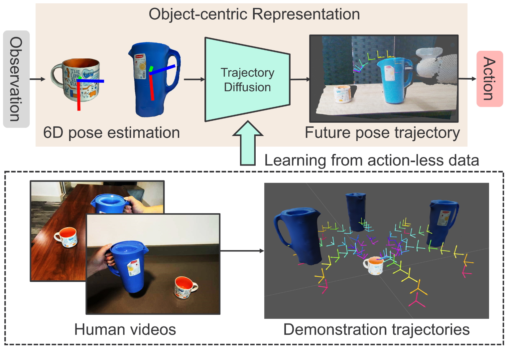
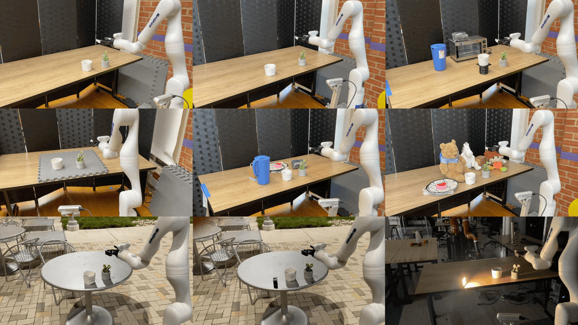
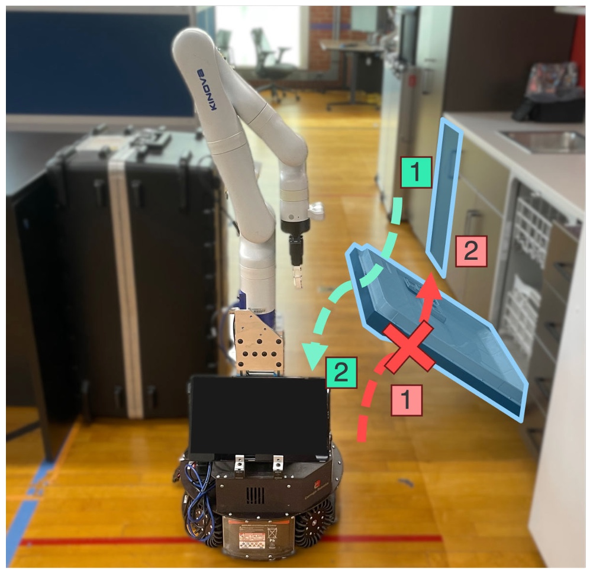
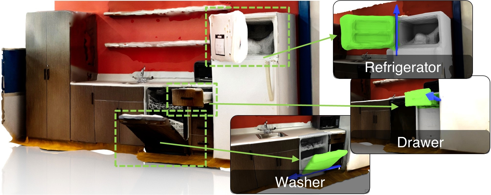
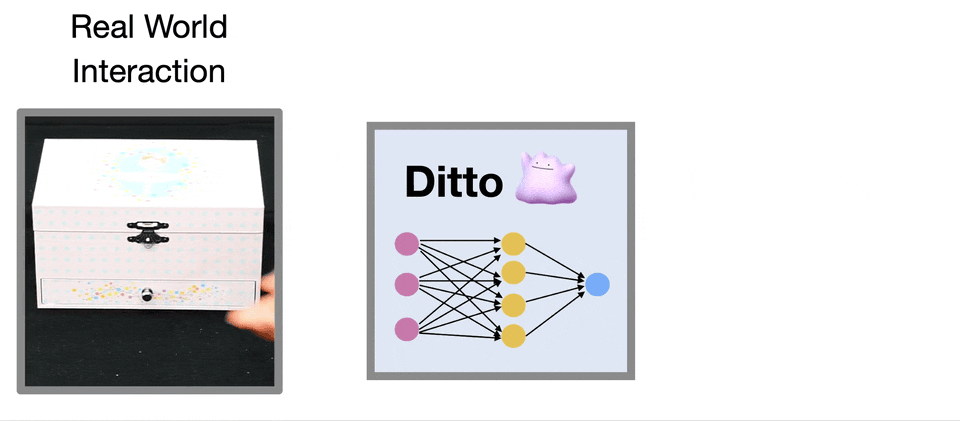

## About Me
I am a Ph.D. student in Computer Science at the <a href="https://www.cs.utexas.edu/">University of Texas at Austin</a>. My research lies at the intersection of <i>robotics</i> and <i>computer vision</i>.

<!-- ## News -->

<h2 id="publications" style="margin: 2px 0px -15px;">Publications <temp style="font-size:15px;">[</temp><a href="https://scholar.google.com/citations?user=9rh0w2QAAAAJ" target="_blank" style="font-size:15px;">Google Scholar</a><temp style="font-size:15px;">]</temp></h2>

<ol class="bibliography">

<li>

  

    <!--  -->
    
  

  

      
<a href="https://nvlabs.github.io/object_centric_diffusion/">SPOT: SE(3) Pose Trajectory Diffusion for Object-Centric Manipulation</a>

      
<u><strong>Cheng-Chun Hsu</strong></u>, Bowen Wen, Jie Xu, Yashraj Narang, Xiaolong Wang, Yuke Zhu, Joydeep Biswas, Stan Birchfield

      
<em>International Conference on Robotics and Automation <strong>(ICRA)</strong>, 2025.</em>
      

    

      <a href="https://nvlabs.github.io/object_centric_diffusion/" class="btn btn-sm z-depth-0" role="button" target="_blank" style="font-size:12px;">Project Page</a>
      <a href="https://arxiv.org/abs/2411.00965" class="btn btn-sm z-depth-0" role="button" target="_blank" style="font-size:12px;">Paper</a>
      <a href="https://github.com/NVlabs/object_centric_diffusion/tree/main" class="btn btn-sm z-depth-0" role="button" target="_blank" style="font-size:12px;">Code</a>
    

     
    We enable robots to learn everyday tasks from human video demonstrations by usinbg object-centric representation. By predicting future object pose trajectories, SPOT achieves strong generalization capabilities with only eight human video demonstrations.
     
  

</li>

 

<li>

  

    <!--  -->
    
  

  

      
<a href="https://chengchunhsu.github.io/KinScene/">KinScene: Model-Based Mobile Manipulation of Articulated Scenes</a>

      
<u><strong>Cheng-Chun Hsu</strong></u>, Ben Abbatematteo, Zhenyu Jiang, Yuke Zhu, Roberto Martín-Martín, Joydeep Biswas

      
<em></em>
      

      <!-- 
<em>A Future Roadmap for Sensorimotor Skill Learning Workshop</em>
      
 -->
      
<em>Mobile Manipulation Workshop at ICRA, 2024.</em>
      

      <strong><i style="color:#e74d3c">Spotlight Presentation</i></strong>
    

      <a href="https://chengchunhsu.github.io/KinScene/" class="btn btn-sm z-depth-0" role="button" target="_blank" style="font-size:12px;">Project Page</a>
      <a href="https://arxiv.org/abs/2409.16473" class="btn btn-sm z-depth-0" role="button" target="_blank" style="font-size:12px;">Paper</a>
    

     
    We enable mobile manipulators to perform long-horizon tasks by autonomously exploring and building scene-level articulation models of articulated objects. It maps the scene, infers object properties, and plans sequential interactions for accurate real-world manipulation.
     
  

</li>

 

<li>

  

    <!--  -->
    
  

  

      
<a href="https://ut-austin-rpl.github.io/HouseDitto/">Ditto in the House: Building Articulated Models of Indoor Scenes through Interactive Perception</a>

      
<u><strong>Cheng-Chun Hsu</strong></u>, Zhenyu Jiang, Yuke Zhu

      
<em>International Conference on Robotics and Automation <strong>(ICRA)</strong>, 2023.</em>
      

    

      <a href="https://ut-austin-rpl.github.io/HouseDitto/" class="btn btn-sm z-depth-0" role="button" target="_blank" style="font-size:12px;">Project Page</a>
      <a href="https://arxiv.org/abs/2302.01295" class="btn btn-sm z-depth-0" role="button" target="_blank" style="font-size:12px;">Paper</a>
      <a href="https://github.com/UT-Austin-RPL/HouseDitto" class="btn btn-sm z-depth-0" role="button" target="_blank" style="font-size:12px;">Code</a>
    

     
    We develop an interactive perception approach for robots to build indoor scene articulation models by efficiently discovering and characterizing articulated objects through coupled affordance prediction and articulation inference.
     
  

</li>

 

<li>

  

    <!--  -->
    
  

  <!-- 

    <video width=175px muted autoplay loop>
      <source src="./assets/data/teaser_cvpr22_ditto.mp4" type="video/mp4">
      Your browser does not support the video tag.
    </video>
  
 -->

  <!-- 

    

      <video width=175px outline:none muted autoplay loop>
        <source src="./assets/data/teaser_cvpr22_ditto.mp4" type="video/mp4">
        Your browser does not support the video tag.
      </video>
    

  
 -->

  

      
<a href="https://ut-austin-rpl.github.io/Ditto/">Ditto: Building Digital Twins of Articulated Objects from Interaction</a>

      
Zhenyu Jiang, <u><strong>Cheng-Chun Hsu</strong></u>, Yuke Zhu

      
<em>Computer Vision and Pattern Recognition <strong>(CVPR)</strong>, 2022.</em>
      

      <strong><i style="color:#e74d3c">Oral Presentation</i></strong>
    

      <a href="https://ut-austin-rpl.github.io/Ditto/" class="btn btn-sm z-depth-0" role="button" target="_blank" style="font-size:12px;">Project Page</a>
      <a href="https://arxiv.org/abs/2202.08227" class="btn btn-sm z-depth-0" role="button" target="_blank" style="font-size:12px;">Paper</a>
      <a href="https://github.com/UT-Austin-RPL/Ditto" class="btn btn-sm z-depth-0" role="button" target="_blank" style="font-size:12px;">Code</a>
    

     
    We develop an approach that builds digital twins of articulated objects by learning their articulation models and 3D geometry from visual observations before and after interaction.
     
  

</li>

 

<li>

  <!-- 
 -->
  

    
  

  <!-- <td style="padding:2.5%;width:30%;vertical-align:middle;min-width:120px">
  
  <!-- <abbr class="badge">ECCV</abbr> -->
  <!-- </td> -->
  

      
<a href="https://chengchunhsu.github.io/EveryPixelMatters/">Every Pixel Matters: Center-aware Feature Alignment for Domain Adaptive Object Detector</a>

      
<u><strong>Cheng-Chun Hsu</strong></u>, Yi-Hsuan Tsai, Yen-Yu Lin, and Ming-Hsuan Yang

      
<em>European Conference on Computer Vision <strong>(ECCV)</strong>, 2020.</em>
      

    

      <a href="https://chengchunhsu.github.io/EveryPixelMatters/" class="btn btn-sm z-depth-0" role="button" target="_blank" style="font-size:12px;">Project Page</a>
      <a href="https://arxiv.org/abs/2008.08574" class="btn btn-sm z-depth-0" role="button" target="_blank" style="font-size:12px;">Paper</a>
      <a href="https://github.com/chengchunhsu/EveryPixelMatters" class="btn btn-sm z-depth-0" role="button" target="_blank" style="font-size:12px;">Code</a>
    

     
    We propose a domain adaptation framework for object detection that uses pixel-wise objectness and centerness to align features, focusing on foreground pixels for better cross-domain adaptation.
     
  

</li>

 

<li>

  

    
  

  

      
<a href="https://papers.nips.cc/paper/2019/file/e6e713296627dff6475085cc6a224464-Paper.pdf">Weakly Supervised Instance Segmentation using the Bounding Box Tightness Prior</a>

      
<u><strong>Cheng-Chun Hsu</strong></u>*, Kuang-Jui Hsu*, Chung-Chi Tsai, Yen-Yu Lin, and Yung-Yu Chuang

      
<em>Neural Information Processing Systems <strong>(NeurIPS)</strong>, 2019.</em>
      

    

      <a href="https://papers.nips.cc/paper/2019/file/e6e713296627dff6475085cc6a224464-Paper.pdf" class="btn btn-sm z-depth-0" role="button" target="_blank" style="font-size:12px;">Paper</a>
      <a href="https://github.com/chengchunhsu/WSIS_BBTP/" class="btn btn-sm z-depth-0" role="button" target="_blank" style="font-size:12px;">Code</a>
    

     
    We propose a weakly supervised instance segmentation method that leverages Multiple Instance Learning (MIL) to address ambiguous foreground separation from bounding box annotations.
     
  

</li>

 

<li>

  

    
  

  

      
<a href="./assets/data/pub_mm18_fashion.pdf">What Dress Fits Me Best? Fashion Recommendation on the Clothing Style for Personal Body Shape</a>

      
Shintami Chusnul Hidayati, <u><strong>Cheng-Chun Hsu</strong></u>, Yu-Ting Chang, Kai-Lung Hua, Jianlong Fu, and Wen-Huang Cheng

      
<em>ACM International Conference on Multimedia <strong>(MM)</strong>, 2018.</em>
      

      <strong><i style="color:#e74d3c">Oral Presentation</i></strong>
    

      <a href="./assets/data/pub_mm18_fashion.pdf" class="btn btn-sm z-depth-0" role="button" target="_blank" style="font-size:12px;">Paper</a>
    

     
    We propose to learn clothing style and body shape compatibility from social big data, offering personalized outfit recommendations by factoring in a user's body shape.
     
  

</li>

</ol>

<h2 id="publications" style="margin: 2px 0px -15px;">Technical Reports</h2>

<ol class="bibliography">

<li>

  

    
  

  

      
<a href="./assets/data/pub_techreport19_ccgr.pdf">Center-context-gap Refinement for Weakly Supervised Instance Segmentation</a>

      
<u><strong>Cheng-Chun Hsu</strong></u>*, Kuang-Jui Hsu*, Chiachen Ho, Yen-Yu Lin, and Yung-Yu Chuang

      
<em>Technical report, 2019.</em>
      

    

      <a href="./assets/data/pub_techreport19_ccgr.pdf" class="btn btn-sm z-depth-0" role="button" target="_blank" style="font-size:12px;">Paper</a>
    

     
    We propose a weakly supervised instance segmentation method using image-level labels, leveraging MIL, semantic segmentation, and a novel refinement module.
     
  

</li>

</ol>

<!-- ## Services
Conference Reviewers: NeurIPS, ICLR, ECCV, WACV, AAAI, IJCAI -->